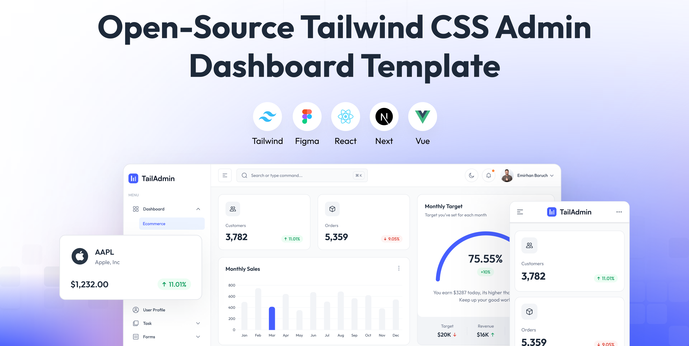

# TailAdmin Vue Components



### `@dynamia-tools/tailadmin-vue`

[](https://www.npmjs.com/package/@dynamia-tools/tailadmin-vue)
[](./LICENSE)
[](https://calver.org)

**Free, always open-source Vue 3 + Tailwind CSS 4 admin dashboard components — install once,
import any component directly, ship a dashboard today.**

This package takes the reusable half of [TailAdmin Vue](https://github.com/TailAdmin/vue-tailwind-admin-dashboard)
— the beautiful, community-loved admin template — and publishes it to npm as plain, importable
source. No forking the repo, no copy-pasting components between projects, no waiting for a build
step: `npm install`, import the component you need, and it just works.

## Why this exists

TailAdmin Vue ships as a full demo application — great for a first look, awkward to reuse across
several projects without dragging its whole app shell along or re-cloning it every time. This
package strips that down to what's actually reusable and puts it behind a normal npm install, so
every Dynamia project (or yours) pulls from one source of truth and stays in sync with a
`npm update`.

## Highlights

- 🧩 **60+ components** — layout (sidebar, header, responsive shell), forms, tables, charts,
  ecommerce widgets, profile cards, and more.
- 🧱 **38 additional `components/ext/*` building blocks** — data tables, form inputs (money,
  OTP/PIN, rating, color…), media capture, navigation, scheduling, and commerce components for
  building real admin/SaaS/ERP/POS features on top of the base template. See
  [below](#extended-component-library-componentsext).
- 📦 **Import exactly what you use** — no bundle, no barrel-file bloat. Pull in one `.vue` file
  and its transitive imports, nothing else.
- 🎨 **Themeable at runtime** — Tailwind v4 compiles colors to CSS custom properties, so
  re-theming the brand color is a one-line `style.setProperty` away. See the picker in
  [`examples/basic-app`](./examples/basic-app) for a working demo.
- 🌓 **Dark mode & RTL** built in, via the same composables the components already use.
- 🆓 **MIT-licensed, no Pro tier, no upsells** — this fork intentionally dropped TailAdmin's
  "Purchase Plan" prompt. Everything in here is free to use.
- 🔄 **Manually synced with upstream**, deliberately — every change is reviewed before it lands,
  see [docs/SYNC.md](./docs/SYNC.md).

## Install

```bash
npm install @dynamia-tools/tailadmin-vue
```

## Usage

Import the theme CSS once in your entrypoint:

```ts
// main.ts
import '@dynamia-tools/tailadmin-vue/style.css'
```

Import components directly from their source path:

```vue
<script setup lang="ts">
import Button from '@dynamia-tools/tailadmin-vue/components/ui/button/Button.vue'
import Alert from '@dynamia-tools/tailadmin-vue/components/ui/Alert.vue'
</script>
```

Composables and icons:

```ts
import { useSidebar } from '@dynamia-tools/tailadmin-vue/composables/useSidebar'
import { BoxCubeIcon } from '@dynamia-tools/tailadmin-vue/icons'
```

Browse `src/components/` in this repo (or in `node_modules` once installed) to see everything
available: `ui/`, `forms/`, `tables/`, `charts/`, `layout/`, `common/`, `profile/`, `ecommerce/`,
plus the extended library under `ext/` (see [below](#extended-component-library-componentsext)).
See [`examples/basic-app`](./examples/basic-app) for a full working Vite app wired up against
this package — every page in the sidebar rendering end to end, plus a live brand-color picker.

For the details — layout components (`AdminLayout`, `AppSidebar`, `AppHeader`,
`NotificationMenu`, `UserMenu`, including how to plug in your own menu, header widgets, and
user/notifications data via their props and slots) and the extended `components/ext` library —
see [docs/USER_GUIDE.md](./docs/USER_GUIDE.md). [`examples/custom-app`](./examples/custom-app) is
a single page putting every layout slot/prop to use at once, with a recolored sidebar and header.

## Extended component library (`components/ext`)

Beyond the base template, this package ships **38 additional, domain-agnostic components**
under `src/components/ext/<category>/`, for building real administrative/SaaS/ERP/POS/ecommerce
features rather than just a demo dashboard: `DataTable`, `TreeTable`, `MoneyInput`, `PinInput`,
`Rating`, `Webcam`, `SignaturePad`, `Calendar`, `Cart`, `ItemGrid`, `Kanban`, `Map`, and more —
see the full catalog and usage patterns in
[docs/USER_GUIDE.md § Extended component library](./docs/USER_GUIDE.md#11-extended-component-library-componentsext).

Every one of them also has a live, interactive demo in
[`examples/basic-app/src/views/ext/`](./examples/basic-app/src/views/ext) — the fastest way to
see one in action before reading its source.

```vue
<script setup lang="ts">
import DataTable from '@dynamia-tools/tailadmin-vue/components/ext/data/DataTable.vue'
import Rating from '@dynamia-tools/tailadmin-vue/components/ext/input/Rating.vue'
</script>
```

## Requirements in the consuming project

- Vue `^3.5`
- Vue Router `^4` or `^5` (used by layout components: sidebar, header)
- Tailwind CSS `^4`, configured to scan `node_modules/@dynamia-tools/tailadmin-vue/src/**/*.vue`
- Vite (or any bundler that resolves relative `.vue`/`.ts` imports via npm `exports`)

Optional dependencies depending on which components you use (declared as optional
`peerDependencies` — install only what you need): `apexcharts` + `vue3-apexcharts` (charts),
`fullcalendar` + `@fullcalendar/vue3` (calendar, also used by `ext/scheduling/Calendar`),
`leaflet` (maps — `CustomerDemographic` and `ext/display/Map`), `jsvectormap` + `vuevectormap`
(vector maps), `flatpickr` + `vue-flatpickr-component` (date picker, also used by
`ext/scheduling/DateRangePicker`), `swiper` (carousels), `vuedraggable` (drag & drop — also used
by `ext/navigation/Kanban`), `dropzone` (upload), `simplebar-vue` (scrollbars), `floating-vue` +
`@floating-ui/vue` (tooltips/popovers), `lucide-vue-next` (icons), `qrcode` (QR code generation —
`ext/display/QrCode`), `temporal-polyfill`.

### Static image assets

A few core layout components (`AppSidebar`, `AppHeader`'s `UserMenu`/`NotificationMenu`)
reference images by absolute path (`/images/logo/*.svg`, `/images/user/*`) instead of importing
them as modules — same as upstream. This package ships that minimal set under `public/`; copy it
into your own project's `public/` directory:

```bash
cp -r node_modules/@dynamia-tools/tailadmin-vue/public/images ./public/
```

Other components (`ProfileCard`, ecommerce widgets, product/country demo data, etc.) reference
additional `/images/...` paths that are **not** bundled here — those are upstream's own demo
placeholder content, not shipped to keep the package light. If you use one of those components
as-is, provide matching files at those paths or adapt the component to your own image props/URLs.

## Versioning

This package uses [CalVer](https://calver.org) (`YY.MM.MICRO`), independent of TailAdmin's own
version numbers — e.g. `26.9.0` is the first release published in September 2026. It makes it
easy to tell at a glance how recently a given release was synced with upstream.

## Syncing with upstream

This package does not git-fork/merge from TailAdmin — it is synced manually when needed,
preserving local changes (relative imports instead of `@/` aliases, `package.json`, `exports`,
this README). See [docs/SYNC.md](./docs/SYNC.md) for the procedure.

## License and attribution

MIT, same as the original project. Original components by [TailAdmin](https://tailadmin.com)
([original repo](https://github.com/TailAdmin/vue-tailwind-admin-dashboard)). See
[LICENSE](./LICENSE).

## Publishing (maintainers)

Publishing to npm runs via GitHub Actions when a **GitHub Release is published**, tagged with the
`package.json` `version` — either `26.9.0` or `v26.9.0` both work, the workflow strips a leading
`v` before comparing (a tag push alone doesn't trigger it — publishing a release does). Requires
the `NPM_TOKEN` secret configured on the repo.

## Support this project

This package is free and always will be — no Pro tier, no paywalled components. If it saved you
time and you'd like to support the maintenance and upstream syncing work, a coffee is always
appreciated:

<a href="https://www.buymeacoffee.com/marioserrano" target="_blank"></a>
